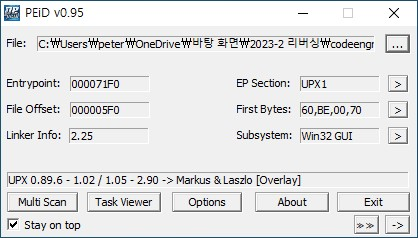
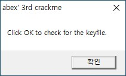
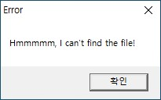
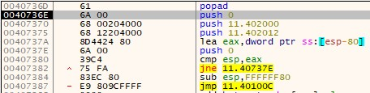
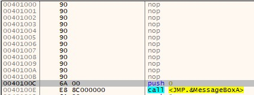
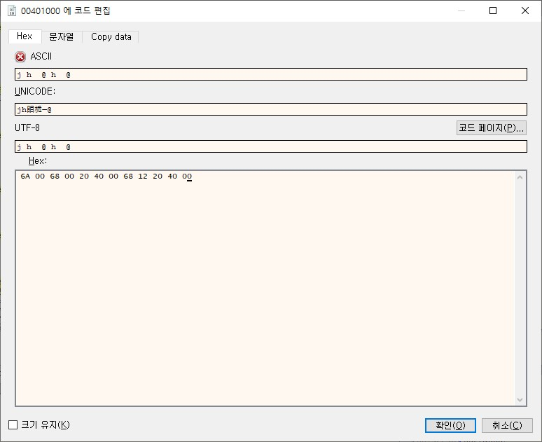
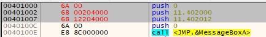

# Basic RCE L11  
문제는 **OEP, stolenbyte**를 찾는 문제입니다.  
처음에 stolenbyte를 찾는 문제여서 패킹 여부를 확인했다.  
  
역시 UPX로 패킹 되어있다. 그런데 stolenbyte를 찾기 위해 언패킹을 하지 않고 문제를 풀었다.  
파일을 실행하면 다음과 같은 창이 뜬다.(뭔가 실패했다는 메세지창 인것 같다)  
   
바로 디버깅 창을 켜서, F9(실행)으로 pushad로 이동하고, pushad를 step over을 한 후, 스택에 breakpoint를 걸었다.  
그리고 popad로 이동했다.  
  
역시 stolenbyte가 있었다. stolenbyte는 **6A0068002040006812204000** 이다.  
그리고 jmp의 주소로 들어가면 다음과 같은 화면이 나온다.  
  
(https://brainfreeee.tistory.com/35 참고)  
원래는 위의 nop에 stolenbyte가 있어야 한다. 그러나 패킹을 방해하기 위해 고의로 stolenbyte를 만드는 것입니다. 원래대로 복구하기 위해 다음과 같이 nop은 부분에 stolenbyte를 적어줍니다.  
  
입력하면, 다음과 같이 코드가 만들어집니다.  
  
따라서 이 프로그램의 OEP는 **00401000**이다.  
이 문제의 정답은 **004010006A0068002040006812204000**이다.  
