# Basic RCE L12번  
문제는 **key**를 구하고, 편집해서 메시지 창에 key가 나오게 하기 위해 overwrite해야하는 **주소**를 구하는 것이다.  
일단 실행을 했다.  
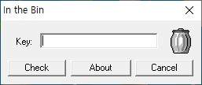  
아무거나 입력하고 check를 눌렀는데, 딱히 아무 반응이 없었다.  
그래서 디버거를 켰다.  
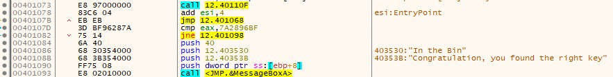  
그런데 디버거에서 프로그램을 실행하니, 다음과 같이 누가봐도 성공구문처럼 생긴 것이 눈에 보였다.  
코드를 살펴봤을 때, eax와 **7A2896BF**와 비교해서 같으면 성공구문으로 간다. 그래서 7A2896BF를 입력했다.  
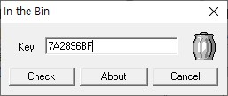  
그런데 실패했을 때처럼 아무 반응이 없었다.  
그래서 cmp 구문에 breakpoint를 걸고 디버깅을 했다.  
그런데 하나 이상한 점이 있었다.  
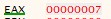  
eax 값을 알기 위해 위처럼 7A2896BF를 입력했는데, eax에 이상한 값이 들어가 있었다.  
그래서 테스트를 하기 위해 123을 입력했다.  
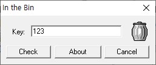  
이번에는 eax값이 신기하게 나왔다.  
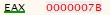  
123을 넣었는데, **7B**가 eax에 있었다. 여기서 갑자기 알파벳이 나온 것을 보고, 16진수로 바꾼 것 같다는 사실을 깨달았다.  
그래서 계산기에 넣어서 확인했다.  
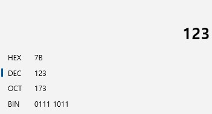  
123이 16진수로 7B라는 사실을 알고나서, 위에서 찾았던 7A2896BF를 10진수로 바꾸었다.  
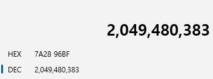  
**2049480383** 라는 숫자가 나왔고, 프로그램에 입력했다.  
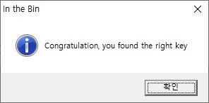  
성공구문이 나왔다. 이제 key를 찾았으니, key가 메시지 창에 나오도록 key를 overwrite하는 주소를 구해야 한다.  
문제에서 HexEdit을 활용하라고 해서, 전에 사용했던 HxD라는 프로그램을 사용했다.  
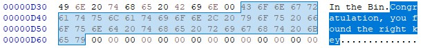  
성공구문이 있는 부분을 찾았고, 우리는 2049480383를 적어주면 된다. key의 길이가 10이고, null문자까지 포함하면 11바이트를 overwrite하면 된다.  
성공구문의 시작주소는 0x00000D3B이므로, **0x00000D3B ~ 0x00000D45** 까지 overwrite하면 된다.
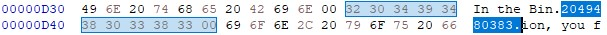  
위와 같이 바꾸었고, 실행을 해서 key를 입력했다.  
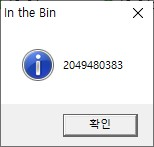  
다음과 같이 key가 메시지 창에 나오는 것을 볼 수 있다.  
따라서 답은 key값 + 주소영역(0x???? ~ 0x????)를 구하면, **20494803830D3B0D45**이다.  
