# Basic RCE L13  
이번 문제는 **정답**을 찾는 문제입니다.  
그래서 프로그램을 실행했습니다.  
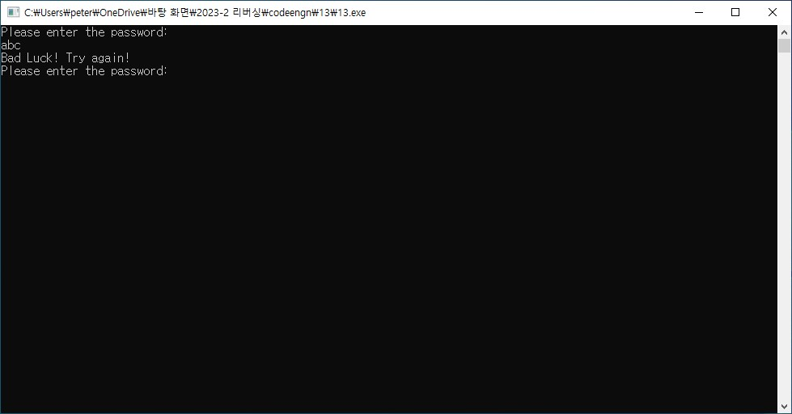  
비밀번호를 입력하라고해서 아무거나 했는데, 잘못입력했다고 나오면서 다시 입력할 수 있게끔 문구가 출력됩니다.  
일단 디버그 프로그램을 켰습니다.  
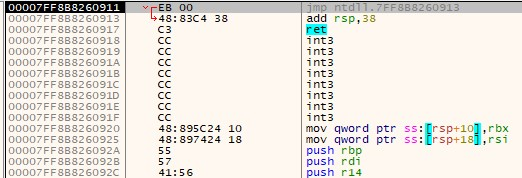  
근데 뭔가 신기했습니다. 명령어 주소도 이상하고, 디버깅을 하면 원래 프로그램이 바로 실행되지 않는데, 실행되는 현상이 일어났습니다.  
이러한 것들은 무시하고, 비밀번호가 틀렸을 때 나오는 문구를 코드에서 찾아봤습니다.  
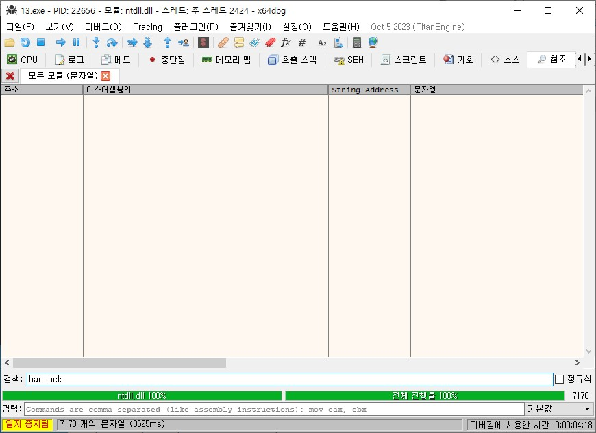  
찾아봤는데, 없습니다.  
그래서 이 코드에 대한 정보를 PEiD로 살펴봤습니다.  
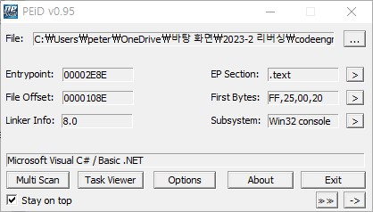  
패킹이 되어있는 것은 아니지만, **C#** 으로 만들어졌다는 것을 알 수 있습니다.  
지금까지 했던 문제들과 결이 달라서 황당했습니다. 그래서 C#을 리버싱하는 방법을 찾아봤습니다.(https://hyunmini.tistory.com/20, https://crazy-m2m.tistory.com/94 참고)  
C# 같은 경우에는 실행파일을 소스코드로 다시 되돌리는 디컴파일을 해서 코드를 보는게 좋다고 합니다.  
그래서 디컴파일러인 dotpeek을 설치해서 디컴파일을 했습니다.  
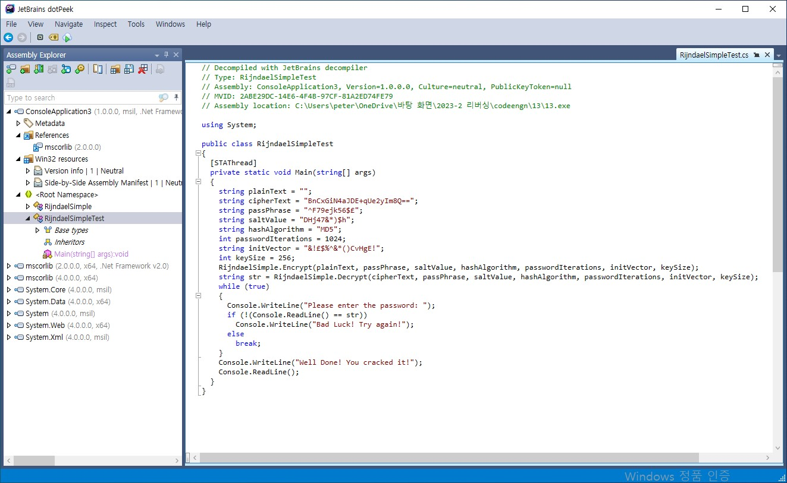  
dotpeek을 실행하여 13.exe파일을 올리면 이렇게 C#으로 이루어진 코드가 나옵니다.  
여기서 주목해야하는 곳은  
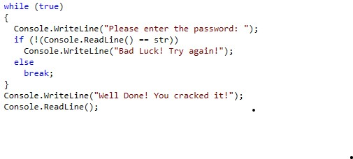  
while문 안에 if-else문 입니다. C#을 배운적이 없어서 정확한 문법은 모르지만 프로그램을 실행했을 때 나오는 기능을 생각해서 추측한다면, 입력한 비밀번호를 **str** 이라는 문자열이랑 비교해서 틀리면 다시 입력받고, 맞으면 break문을 통해 비밀번호를 맞췄다는 문구가 나오는 것으로 추측할 수 있습니다.  
그래서 str에 들어갈 값(비밀번호)을 만드는 함수에 들어가서 코드를 해석해보고자 했지만, C#을 배운적이 없어서 난감했고, 심지어 코드가 길어서 포기했습니다.  
그런데 dotpeek에서 현재 올린 실행파일을 project로 만들어서 비주얼 스튜디오에서 편집을 할 수 있다고 해서, project로 만들었습니다.  
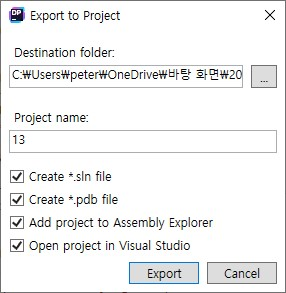  
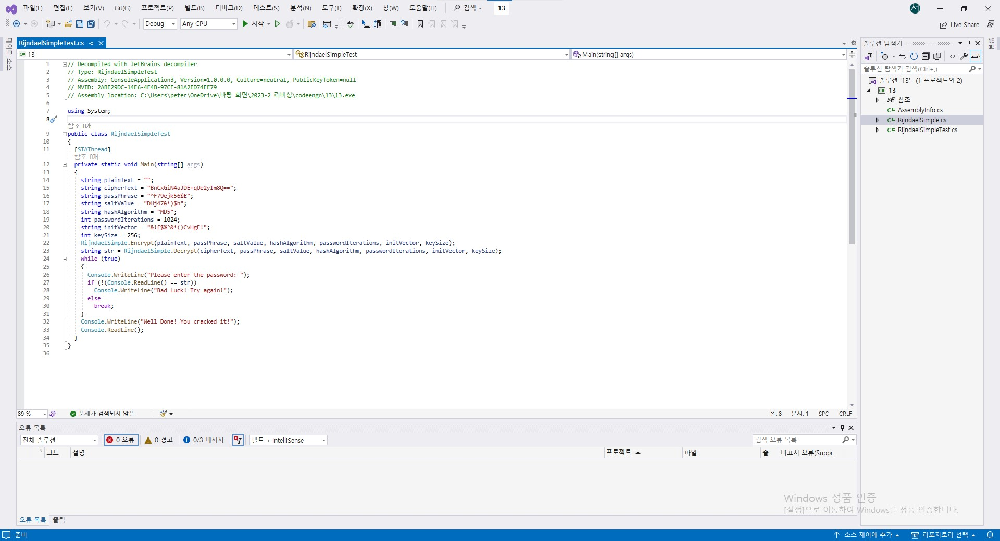  
project로 만들고 비주얼 스튜디오로 파일을 열었습니다.  
제가 생각한 방법은 str을 모르면, str을 그냥 출력하면 되겠다고 생각했습니다.  
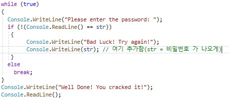  
그래서 아까 봤던 if-else문에서 잘못된 값을 입력했을 때, str(비밀번호)가 출력되게끔 코드를 편집했습니다.  
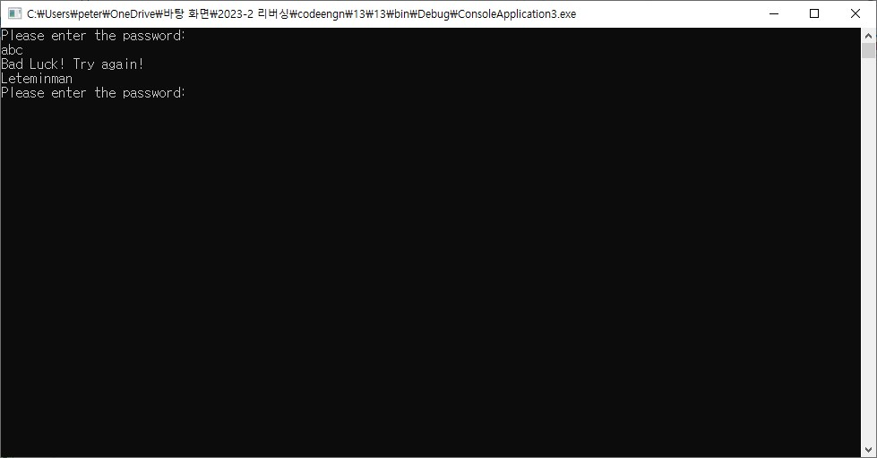  
그 다음으로 비주얼 스튜디오에서 실행하고, 아무 문자열이나 입력했는데, **Leteminman**이라는 비밀번호가 나왔습니다.  
그래서 바로 13.exe을 실행해서 입력했습니다.  
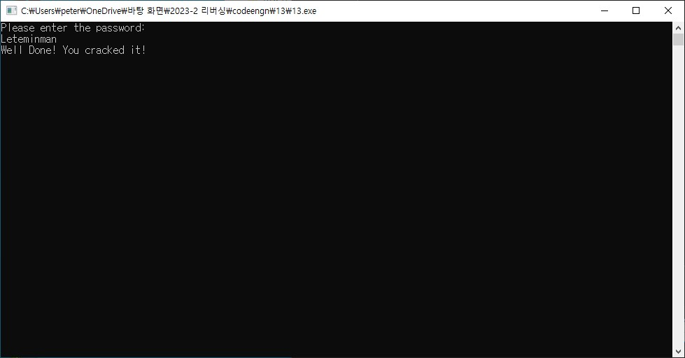  
비밀번호가 맞다는 성공문구가 나왔습니다.  
따라서 문제에서 요구하는 비밀번호는 **Leteminman** 입니다.
