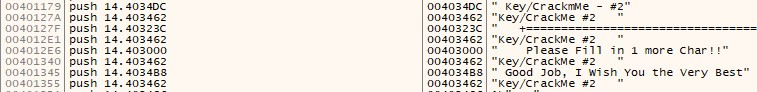
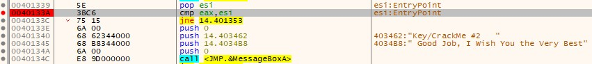
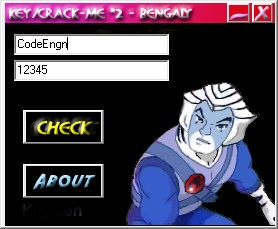
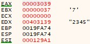
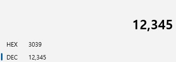
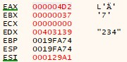
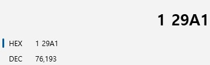
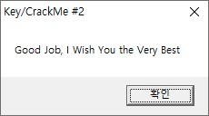

# Basic RCE L14  
문제는 Name이 CodeEngn 일때 **Serial**을 구하는 문제입니다.  
바로 프로그램을 실행했습니다.  
   
전에 나오던 문제랑 비슷하게, 2가지(name, serial)을 입력하는 창이 나와서 아무거나 입력했는데, 역시 실패구문이 나왔습니다.  
그래서 디버깅을 했습니다.  
  
이번에도 성공구문을 찾았습니다.  
  
breakpoint를 설정한 곳이 성공, 실패 분기점입니다.  
eax, esi를 비교해서 같으면 성공, 다르면 실패로 가는 것처럼 보입니다.  
  
문제에서 Name이 CodeEngn일 때 serial을 구하라고 했으므로, CodeEngn을 넣고 serial은 아무거나(**12345**) 넣고 테스트 했습니다.  
  
성공, 실패 분기점에 왔을 때, eax는 3039가 나왔고, esi는 **129A1**이 나왔습니다. 일단 전 문제에서 eax에 입력한 값의 16진수가 들어갔었기 때문에, 이번에도 의심을 하면서 확인을 했습니다.  
  
역시 **12345의 16진수는 3039**였습니다. 즉, **eax는 입력한 serial의 16진수** 입니다. 그렇다면 esi의 정체를 알아야 해서, name은 그대로하고 serial을 다르게 했습니다.  
   
eax는 다르게 나왔고, esi는 그대로 나왔습니다. 따라서 **esi는 name(CodeEngn)에 따라 달라지는 것**을 알 수 있습니다.  
즉, 성공구문으로 가기 위해서, eax와 esi가 같아야 하므로, eax가 129A1가 나오면 됩니다.  
  
129A1을 10진수로 변환하면 **76193**입니다.  
따라서 저희가 입력해야 하는 serial은 76193 입니다.  
   
다음과 같이 CodeEngn과 76193을 입력하면, 성공 구문이 나옵니다.  
따라서 문제에서 요구하는 Serial은 **76193** 입니다.  

