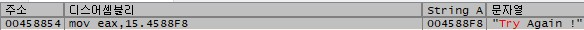
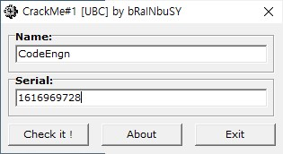

# Basic RCE L15  
문제는 **Name이 CodeEngn일때 Serial**을 구하는 문제입니다.  
이전 문제와 거의 비슷해보입니다.  
바로 프로그램을 실행했습니다.  
   
name에 CodeEngn을 넣고, serial에 **12345**를 넣었을 때 역시 실패 구문을 볼 수 있습니다.  
그래서 디버깅을 했습니다.  
  
디버깅을 할 때 먼저 실패 구문(Try Again!)을 검색했고, 찾았습니다.  
그래서 그 문자열이 있는 것으로 이동했습니다.  
  
breakpoint을 설정한 곳이 성공/실패 분기점입니다.  
여기서는 **eax와 dword ptr ds:[45B844]** 를 비교해서 같으면 성공, 틀리면 실패로 가게끔 구현되어있습니다.  
우선 이번 문제에서 eax가 무엇인지 알아봤습니다.  
  
name에 CodeEngn, serial에 12345를 넣은 상태에서 분기점에 오면 eax가 위의 사진과 같습니다.  
전 문제처럼 12345를 16진수로 바꾸면, 3039가 나옵니다.  
따라서 **eax는 입력한 serial의 16진수**입니다.  
  
그렇다면 **dword ptr ds:[45B844]** 는 무엇인지 알아봐야 합니다. 우선 하나씩 보면, dword는 double word의 약자로 word(2 byte)의 2배인 4 byte를 의미합니다.(https://shotgh.tistory.com/32)  
물론 컴퓨터에 따라 다르지만, 일반적으로 word는 4 byte입니다.(https://mspproject2023.tistory.com/625)  
그런데 DWORD는 사실 32bit 운영체제가 되면서 만들어졌습니다.  
16bit 운영체제 당시 WORD는 16bit(2 byte)를 의미하였으며 이 전통이 32bit 운영체제가 되면서까지 이어진 것입니다.(https://m.blog.naver.com/PostView.naver?isHttpsRedirect=true&blogId=soft_sand&logNo=220438978537)  
그래서 이 문제에서는 dword가 4 byte인 것을 알면 됩니다.  
**ptr**은 c언어나 c++에서 사용하는 **포인터**를 의미합니다.  
**ds**는 deta segment로 변수들이 저장되어 있는 공간입니다.(https://blog.naver.com/PostView.nhn?blogId=heobk1&logNo=221405826521)  
**45B844**는 메모리 주소입니다.  
즉, **주소 45B844에서 4 byte**를 의미합니다.  
   
그래서 45B844로 이동했고, dword ptr ds:[45B844]의 값은 16진수로 차례 대로, 0x60, 0x61, 0x00, 0x00를 의미합니다.  
그렇다면, eax는 입력한 serial의 16진수 이므로, serial과 0x60610000의 10진수가 같다는 의미입니다.  
  
0x60610000의 10진수는 **1616969728**이고, 이를 serial에 넣으면 정답이라고 생각했습니다.  
   
그런데 틀렸다고 합니다.  
이 때 잘못 계산한 줄 알고 다시 했는데, 아무리 다시 계산해도 맞아서 이에 관련해서 검색했습니다.  
  
원인은 **big/little endian** 였습니다.(https://www.tcpschool.com/c/c_refer_endian)  
## Big Endian  
  
먼저 Big Endian은 메모리에 값을 저장할 때, <b>낮은 주소에 데이터의 높은 바이트(MSB, Most Significant Bit)부터 저장</b> 하는 방식입니다. 
예시로 0x12345678을 저장한다고 가정하겠습니다. 
Big Endian의 경우에는 낮은 주소에 높은 바이트부터 저장하기 때문에, 낮은 주소부터 0x12, 0x34, 0x56, 0x78 순으로  저장하는 방식입니다.  

## Little Endian 
  
반대로 Little Endian은 메모리에 값을 저장할 때, <b>낮은 주소에 데이터의 낮은 바이트(LSB, Least Significant Bit)부터 저장</b> 하는 방식입니다. 
위의 예시처럼 0x12345678을 저장하다고 가정하겠습니다.  
Little Endian의 경우에는 낮은 주소에 데이터의 낮은 바이트부터 저장하기 때문에, 낮은 주소부터 0x78, 0x56, 0x34, 0x12 순으로 저장하는 방식입니다. 
 
즉, 아까 위에있던 0x60, 0x61, 0x00, 0x00를 big endian으로 읽으면 <b>0x60610000</b>이 되고, little endian으로 읽으면 <b>0x00006160</b>이 됩니다.  
보통 컴퓨터에서는 intel 계열의 CPU를 사용하는데, intel은 little endian을 사용합니다.  
그래서 이 문제는 little endian을 사용해서 <b>0x00006160</b>로 데이터를 인식해야 합니다.  
  
따라서 0x00006160 -> 0x6160 -> <b>24928</b>입니다.  
   
name에 CodeEngn, serial에 24928을 넣으면 성공구문이 나옵니다.  
따라서 답은 <b>24928</b>이다.  

