# Basic RCE L16  
이번 문제는 **Name이 CodeEngn일때 Serial**을 구하는 문제입니다.  
우선 파일을 실행했습니다.  
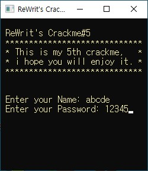 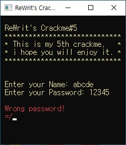  
name과 password를 입력했는데, 잘못된 비밀번호라는 문구가 나오고 실행이 종료됩니다.  
혹시 패킹이 되었는지 확인하기 위해, PEiD에서 확인했습니다.  
  
패킹은 되어있지 않은 것 같지만, DEV-C++이라는 문구가 있었습니다.  
아마 C++로 만들어진 코드 같은데, 일단 최대한 디버깅을 이용하여 풀어보기로 했습니다.  
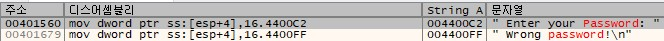  
먼저 실패 문구를 찾아서 해당 위치로 이동했습니다.  
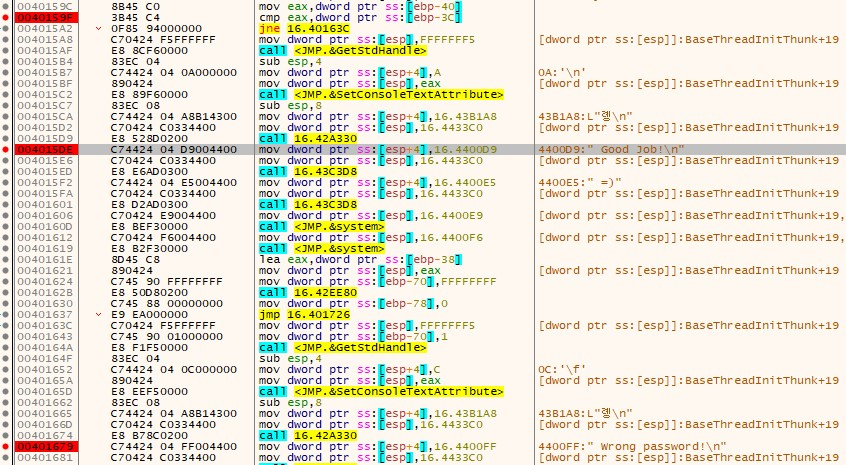  
성공/실패 분기점, 성공/실패 구문에 breakpoint를 걸었습니다.  
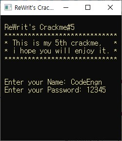 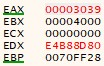  
위와 같이 name에 CodeEngn을 입력하고, 비밀번호는 아무거나 입력하고 분기점까지 실행했을 때, 레지스터 값들이 다음과 같았습니다.  
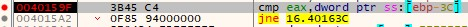  
위에서 레지스터 값들을 본 이유는, 분기점에서 **cmp eax, dword ptr ss:[ebp-3C]** 라는 명령어가 있습니다.  
이미 15번 문제에서 봤던 명령어입니다.  
간단히 말하면, **eax**와 **ebp-3C부터 4바이트**를 비교하는 명령어 입니다.  
즉, 두 값이 같으면 성공구문으로 이동합니다.  
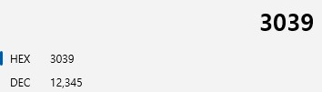  
먼저 eax의 정체를 알아보면, 위에서 비밀번호로 **12345**를 입력했는데, **eax가 3039**가 나왔습니다.  
3039는 12345의 16진수 입니다.  
따라서 **eax는 입력한 비밀번호의 16진수** 입니다.  
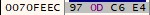  
다음으로 dword ptr ss:[ebp-3C] 의 정체를 알아봐야 합니다.  
일단 명령어에 대한 설명은 위에 있으므로, **ebp-3C 부터 4바이트**를 의미합니다.  
그리고 15번 문제처럼 little endian으로 숫자를 적으면, **0xE4C60D97**입니다.  
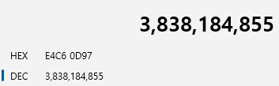  
이를 10진수로 바꾸면 **3838184855**입니다.  
즉, 비밀번호는 **3838184855** 입니다.  
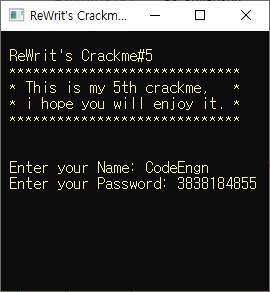 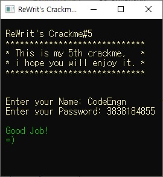  
성공구문이 나왔습니다.  
따라서 정답은 **3838184855** 입니다.  

