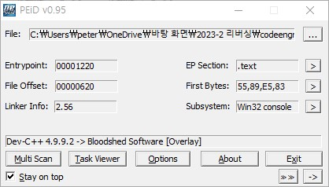
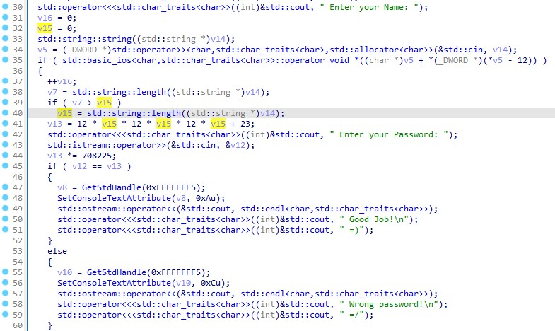

# Basic RCE L16  
이번 문제는 **Name이 CodeEngn일때 Serial**을 구하는 문제입니다.  
우선 파일을 실행했습니다.  
   
name과 password를 입력했는데, 잘못된 비밀번호라는 문구가 나오고 실행이 종료됩니다.  
혹시 패킹이 되었는지 확인하기 위해, PEiD에서 확인했습니다.  
  
패킹은 되어있지 않은 것 같지만, DEV-C++이라는 문구가 있었습니다.  
아마 C++로 만들어진 코드 같은데, 일단 최대한 디버깅을 이용하여 풀어보기로 했습니다.  
  
먼저 실패 문구를 찾아서 해당 위치로 이동했습니다.  
  
성공/실패 분기점, 성공/실패 구문에 breakpoint를 걸었습니다.  
   
위와 같이 name에 CodeEngn을 입력하고, 비밀번호는 아무거나 입력하고 분기점까지 실행했을 때, 레지스터 값들이 다음과 같았습니다.  
  
위에서 레지스터 값들을 본 이유는, 분기점에서 **cmp eax, dword ptr ss:[ebp-3C]** 라는 명령어가 있습니다.  
이미 15번 문제에서 봤던 명령어입니다.  
간단히 말하면, **eax**와 **ebp-3C부터 4바이트**를 비교하는 명령어 입니다.  
즉, 두 값이 같으면 성공구문으로 이동합니다.  
  
먼저 eax의 정체를 알아보면, 위에서 비밀번호로 **12345**를 입력했는데, **eax가 3039**가 나왔습니다.  
3039는 12345의 16진수 입니다.  
따라서 **eax는 입력한 비밀번호의 16진수** 입니다.  
  
다음으로 dword ptr ss:[ebp-3C] 의 정체를 알아봐야 합니다.  
일단 명령어에 대한 설명은 위에 있으므로, **ebp-3C 부터 4바이트**를 의미합니다.  
그리고 15번 문제처럼 little endian으로 숫자를 적으면, **0xE4C60D97**입니다.  
  
이를 10진수로 바꾸면 **3838184855**입니다.  
즉, 비밀번호는 **3838184855** 입니다.  
   
성공구문이 나왔습니다.  
따라서 정답은 **3838184855** 입니다.  

# Basic RCE L16(C++ 디컴파일)  
위에서 어셈블리어로 풀었다면, 이번에는 c++을 디컴파일을 해서 풀어보고자 합니다.  
c++을 디컴파일 하는 방법은 **IDA** 라는 프로그램을 사용하면 됩니다.  
c++로 디컴파일하면 다음과 같이 코드가 나옵니다.  
  
  
31 ~ 32번째 줄 : **v15, v16 = 0**
34번째 줄 : **v14(name)** 을 입력받아서 **v5**에 넣는다.  
38번째 줄 : **v7**에 **v14(name)의 길이**를 넣는다.  
39 ~ 40번째 줄 : 만약 **v7 > v15**이면(**name의 길이가 0보다 크다**면), **v15에 name의 길이**를 넣는다.  
  
41번째 줄 : **v13**에 **12 * v15(name 길이) * 12 * v15 * 12 * v15 + 23 = 884759**를 넣습니다.  
43번째 줄 : **v12에 password**를 넣는다.  
   
44번째 줄 : **v13에 708225**를 곱한다.(v13 = 884759 * 708225 = 626608442775 -> 3838184855(아마 **오버플로우** 때문에 숫자가 바뀐 것 같다)  
추가 설명(https://dojang.io/mod/page/view.php?id=32, https://offbyone.tistory.com/115) : v13은 **unsigned int**이므로, 범위가 **0 ~ 4,294,967,295** 입니다.  
따라서 **626608442775은 v13에 전부 넣지 못합니다**. 그래서 몇이 들어가는지 아는 방법은 **숫자 범위로 나머지 연산을 하고, 최소 숫자에 나머지를 더하면 됩니다.**  
**626608442775 mod 4294967296 = 3838184855**이므로, **0 + 3838184855 = 3838184855**입니다. 따라서 **v13에는 3838184855**가 들어갑니다.  
45 ~ 51번째 줄 : 만약 **v12 == v13**이면(password와 3838184855 가 같으면), **성공 구문**을 출력한다.  
53 ~ 59번째 줄 : **v12 != v13**이면, **실패 구문**을 출력한다.  

