# Basic RCE L17  
문제는 **Key 값이 BEDA-2F56-BC4F4368-8A71-870B 일때 Name에 대한 MD5해시값**을 구하는 것 입니다.  
먼저 프로그램을 실행했습니다.  
그리고 name에 A를 넣고, key는 문제에서 주어진 key를 넣었습니다.  
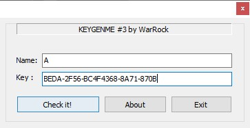 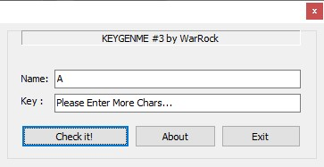  
여기서 의문점이 들었던 것은 check를 누르니까, name에 더 많은 문자를 넣으라고 했습니다.  
그런데 문제에서 **힌트로 name은 1글자**라고 주어졌습니다.  
이 때, 문제에 오류가 있는 줄 알고 검색을 했지만, 이 문제의 의도가 그 오류를 제거하는 것이었습니다.  
그래서 디버깅을 했습니다.  
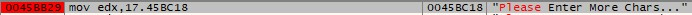 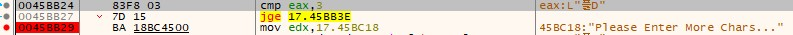  
들어가서 아까 나왔던 문구를 찾아서 위치를 이동했습니다.  
먼저 **jge** 명령어는 **비교 결과 값이 '0'이거나(ZF=1), 큰 경우 해당 주소로 점프**하는 명령어입니다.(https://swzz.tistory.com/30)  
여기서 위에 있는 **cmp eax, 3**에 의해, eax(입력한 name의 길이)가 3 이상이어야 프로그램이 동작합니다.  
따라서 **cmp eax, 1**로 바꾸었습니다.  
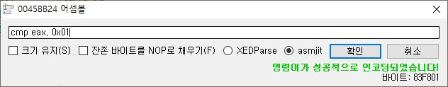 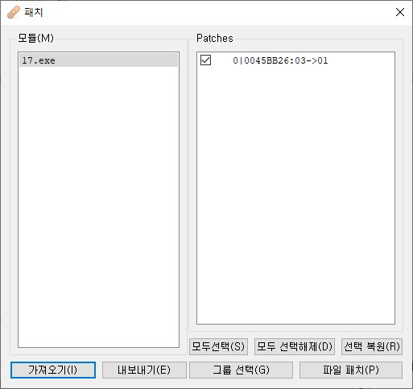  
명령어를 바꾼 후에 패치를 하고, 새로운 명령어가 적용된 파일을 저장했습니다.  
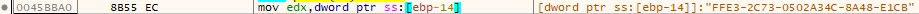  
그리고 디버깅을 하던 도중에 갑자기 key와 형식이 같은 문자열이 나왔습니다.  
여기서 저 문자열이 **name이 A일 때 key값**이라는 것을 알았습니다.  
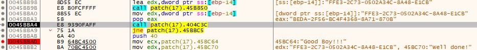  
여기가 성공구문이 나오는 분기점인데, 위에 있는 호출한 함수 2개 중에 아래에 있는 함수로 들어갔다.  
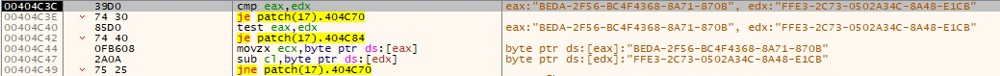  
이 함수를 봤을 때, 기능은 두 문자열을 비교하는 함수이다.  
즉, 입력한 key값과 올바른 key 값을 비교하는 함수이다.  
그리고 위에 있던 함수 중 위에 있는 함수로 들어갔다.  
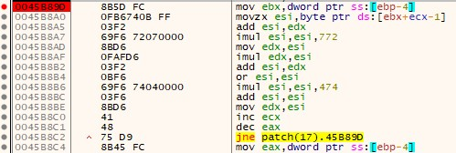  
이번에 들어간 함수가 바로 **name에 따라 key값을 만드는 함수**였다.  
여기 부분을 디버깅한 결과, **loop처럼 보이는 곳이 5개 정도** 보였습니다.  
그래서 각 loop가 **key의 하이폰으로 나뉘어진 부분을 만드는 것**으로 추측했습니다.  
위에 있는 사진은 바로 나오는 loop이며, 문제에서는 **BEDA를 만드는 loop**입니다.  
  
사실 처음에는 여기서 코드 분석하기 힘들어서 힌트에 있던 숫자, 알파벳을 전부 넣어서 답을 찾았다.  
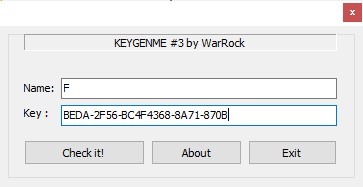 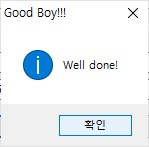  
결국 name은 **F** 였고, MD5해시값을 구하면,  
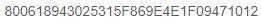  
**800618943025315F869E4E1F09471012** 입니다.  
  
# 코드 분석해서 코딩으로 푸는 방법  
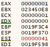  
우선 위에 그림에 있는 loop에 들어가면 레지스터의 초기값이 다음과 같습니다.  
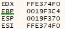  
loop를 돌면 레지스터가 다음과 같습니다.  
자세히 보면 edx, esi값의 앞부분이 <b>FFE3</b> 입니다.  
즉, loop를 돌았을 때 구한 key값이 edx, edi의 앞부분 4바이트를 의미합니다.  
따라서 힌트에서 주어진 name의 범위와 반복문을 이용하여 이 loop를 c++로 코딩하면 다음과 같습니다.  
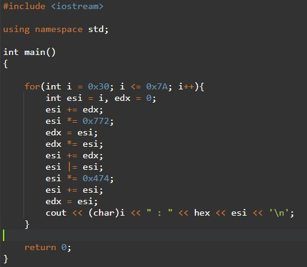 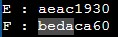  
따라서 문제에서 주어진 key의 BEDA와 동일한 것은 <b>F</b>입니다.  
위처럼 MD5해시값을 구하면, <b>800618943025315F869E4E1F09471012</b>입니다.  

