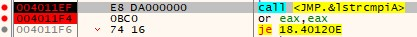
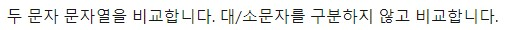

# Basic RCE L18  
문제는 **Name이 CodeEngn일때 Serial**을 구하는 문제입니다.  
먼저 프로그램을 실행하면 다음과 같습니다.  
   
먼저 name에 abcd를 입력하고, serial에 아무거나 입력했는데, name을 최소 5글자 이상 입력하라는 문구가 나와서 abcde를 입력했는데, 실패 구문이 나왔습니다.  
바로 디버깅을 했습니다.  
  
프로그램을 실행하고, 실패구문을 검색해서 찾았습니다.  
그 문자열이 있는 곳으로 이동했습니다.  
  
성공/실패 구문이 있고, 이에 대한 분기점인 **or eax, eax**와 **je 실패구문** 이 있는 것을 알 수 있다.  
  
그래서 문제에 따라 name에 CodeEngn을 넣고, serial은 12345를 넣고 실행을 했다.  
  
or eax, eax에 왔을 때의 레지스터 상태이다.  
je 명령어는 ZF가 1일 때 jump를 하는 명령어이다.  
따라서 성공구문으로 가기 위해서는 **or eax, eax에서 0**이 나와야 한다.  
이 뜻은 **eax가 0이어야 한다**는 의미이다.  
   
그래서 다시 실행해서 위에 있는 함수에 breakpoint를 걸고 레지스터 값을 봤는데, eax가 달라져 있었다.  
그래서 step over을 했을 때, 다시 eax가 1이 되었다.  
즉, 현재 name에 CodeEngn을 넣고, serial은 12345를 넣은 상황에서 **lstrcmpiA라는 함수의 return 값으로 eax는 1**이 된다는 뜻이다.  
그래서 이 함수에 대한 정보를 찾아봤다.(https://learn.microsoft.com/ko-kr/windows/win32/api/winbase/nf-winbase-lstrcmpia 참고)  
   
우선 lstrcmpiA는 두 문자열을 비교하는 함수이다.  
매개변수로는 비교할 문자열 2개를 필요로 한다.  
그리고 return 값은 두 문자열이 같으면 0, 다르면 0이 아닌 값이 나온다.  
그렇다면, 함수를 호출하기 전에 위에서 우리가 적은 12345와 올바른 serial을 push한 명령어가 있어야 한다.  
  
역시 위에 입력한 serial인 12345와 올바른 serial인 **06162370056B6AC0**를 push하고 비교합니다.  
즉, 우리가 입력한 serial이 **06162370056B6AC0**이어야 합니다.  
   
다음과 같이 입력했고, 성공구문이 나왔습니다.  
따라서 정답은 **06162370056B6AC0**입니다.  
