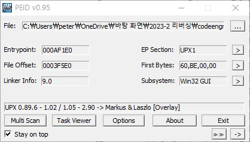
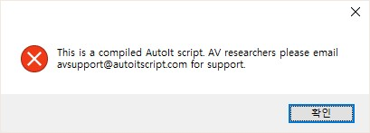
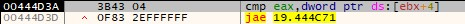

# Basic RCE L19  
문제는 **이 프로그램은 몇 밀리세컨드 후에 종료 되는가** 입니다.  
우선 실행하기 전에 프로그램의 패킹 여부를 봤습니다.  
   
UPX로 패킹 되어있었습니다.  
그래서 바로 언패킹하고 프로그램을 실행했습니다.  
  
이 메세지 창이 뜨고, 몇 초 뒤에 자동으로 종료됩니다.  
그래서 디버깅을 했습니다.  
  
그런데 디버깅을 하는 도중에 이러한 메세지 창이 나오고 꺼집니다.  
그래서 이 문자열을 검색했습니다.  
  
일단 이 문자열이 있는 곳으로 갔지만, 코드가 정말 길었고, 디버깅하는 것도 어려웠다.  
그러다가 이 프로그램에 대해 다시 생각해봤다.  
프로그램을 실행했을 때는 정상적으로 되지만, 디버깅 할 때는 정상적으로 나오지 않는 프로그램이다.  
이 때 좀 고민을 하다가 전에 이렇게 디버깅을 탐지하는 문제를 풀었던 기억이 났다.  
그 때는 **IsDebuggerPresent**라는 함수를 사용했다.  
그래서 이와 같은 디버거를 탐지하는 함수가 있는지 확인했다.  
  
검색해보니 디버거를 탐지하는 함수가 있었다.  
그래서 breakpoint를 걸고 이동했다.  
   
일단 아래 쪽에 **test구문과 jne구문**이 있는데, 여기서 jne로 의해 jump하면, 실패구문(디버거가 탐지됬다는)이 나오는 곳으로 이동한다.  
그래서 jne에서 jump를 하면 안된다.  
그런데 IsDebuggerPresent의 return 값이 eax에 들어가고, 이는 1이 나왔다.  
즉, **디버거를 탐지했다**는 의미이다.  
만약 이대로 진행이 되면, **test eax, eax**에 의해 ZF가 0이 되고, jump되어 실패구문으로 이동합니다.  
즉, jump가 되지 않게 값을 바꾸거나 명령어를 바꾸어야 합니다.  
  
저는 test eax, eax를 **cmp eax, eax**로 바꾸었습니다.  
cmp eax, eax를 실행하면, eax는 eax와 같기 때문에 ZF가 1로 설정되기 때문에 jump를 하지 않습니다.  
그리고 이 뒤로 디버깅을 했는데, 진전이 없어서, 여기부터는 검색하면서 찾아봤습니다.  
  
일단 이 문제에서 사용하는 시간 관련 함수는 **timeGetTime**이라는 함수입니다.(https://learn.microsoft.com/ko-kr/windows/win32/api/timeapi/nf-timeapi-timegettime)  
기능은 시스템 시간을 return합니다.  
결론적으로 현재 시간이 얼마나 지났는지 체크하는 함수입니다.  
  
일단, 이 함수에 전부 breakpoint를 걸었습니다.  
그리고 프로그램을 실행했을 때, 다음 위치로 이동했습니다.  
  
이 코드는 timeGetTime을 edi로 옮기는 코드입니다.  
바로 밑에 **call edi**가 있는데, 이 명령어를 실행할 때마다 timeGetTime을 호출합니다.  
이 뒤로 계속 디버깅을 하면 다음과 같은 부분으로 jump합니다.  
  
**cmp eax, dword ptr ds:[ebx+4]** 가 있습니다. 그리고 **jae 주소**가 있습니다.(https://baekcedar.tistory.com/27)  
jae는 **CF = 0 OR ZF = 1**인 경우에 jump합니다.  
즉, cmp에 영향을 받는 명령어 입니다.  
여기서 **eax와 dword ptr ds:[ebx+4] 가 같으면, jump**를 한다.  
이 때 jump를 하고 몇 줄 실행하면 메시지 창이 뜬다.  
다른 경우에는 for문처럼 반복했다(코드가 길고 해석하기 어려워서 따로 이미지를 캡처하지는 않았다)  
즉, **eax와 dword ptr ds:[ebx+4]가 같을 때 까지 반복**을 한다.  
따라서 우리가 구해야 하는 시간은 **dword ptr ds:[ebx+4]** 이라고 생각할 수 있다.  
   
현재 ebx+4로 이동하면, **0x2B70**이다.  
이를 10진수로 변환하면 다음과 같다.  
  
따라서 정답은 **11120**이다.  
