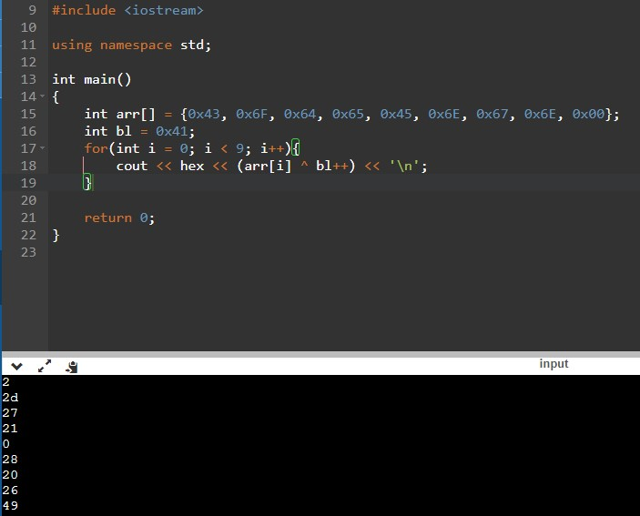
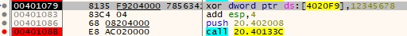

# Basic RCE L20  
문제는 **'Cracked by: CodeEngn!' 문구가 출력 되도록 하려면 crackme3.key 파일안의 데이터는 무엇이 되어야 하는가** 에 대한 문제입니다.  
우선 프로그램을 실행했습니다.  
  
아무것도 나오지 않았습니다.  
처음에 디버깅을 했는데, 감이 전혀 오지 않아서 IDA를 이용하여 디컴파일해서 알아봤습니다.  
  
여기서 9 ~ 10번째 줄을 보면, **CreateFileA** 라는 함수가 있다.(https://learn.microsoft.com/ko-kr/windows/win32/api/fileapi/nf-fileapi-createfilea)  
일단 기능은 **파일 또는 I/O 디바이스를 만들거나 여는** 기능을 한다.  
만약 함수가 실패하는 경우에는 **INVALID_HANDLE_VALUE**가 return 되는데 보통의 경우에는 -1이라고 한다.  
또한 다른 함수로 **ReadFile**라는 함수가 있다.(https://learn.microsoft.com/ko-kr/windows/win32/api/fileapi/nf-fileapi-readfile)  
말 그대로, 파일의 데이터를 읽는다.  
그래서 if문을 정리하면, 원하는 파일(crackme3.key)이 존재하고, 그 파일에서 18바이트를 읽는 다는 뜻입니다.  
물론 뒤에 더 있지만, 이에 대한 부분은 차차 알아볼 것입니다.  
결론적으로 이 문제를 풀기 위해 crackme3.key라는 파일을 만들어서 18바이트의 데이터가 들어있어야 한다.  
그래서 그냥 아무 의미 없는 숫자를 넣은 crackme3.key를 만들었다.  
   
그래서 디버깅을 시작했다.  
계속 디버깅을 하다보니 다음과 같이 EBX에 파일의 데이터가 들어있는 모습을 볼 수 있습니다.  
   
그러나 현재 커서에 있는 **xor dword ptr ds:[4020F9], 12345678**을 실행하면, 다음과 같이 EBX의 값이 바뀝니다.  
그래서 그 위에 있는 **call 20.401311**로 들어갔습니다.  
  
함수 내부로 들어오면 다음과 같이 구현되어 있습니다.(참고로 loop문 입니다)  
1. ecx, eax 0으로 초기화(xor)
2. esi : 00402008(입력한 데이터가 들어있는 주소)
3. bl = 0x41, al = 00402008 + i(반복 수)(입력한 데이터를 1바이트 씩 가져옴)
4. al ^= bl
5. 00402008 + i(반복 수) = al
6. esi++, bl++
7. 4020F9 += eax
8. if(al == 0)(만약 현재 가져온 문자가 0이면) -> end(루프 끝)
9. else -> cl++
10. if(bl == 4F)(현재 bl == 4F이면, 최대 데이터를 초과하므로 끝) -> end(loop 끝)
  
이러한 방식으로 입력한 데이터가 변합니다.  
   
위처럼 입력한 데이터의 14바이트를 변경합니다.  
   
아래에 성공구문이 보이는데, 평범하게 디버깅을 하면 성공구문으로 가지 않았다.  
따라서 명령어를 바꾸어서 성공구문으로 이동하게 했다.  
   
위의 명령어를 통해 성공구문이 들어있는 메시지가 나온다.  
그리고 우리가 위에서 봤던 변형된 데이터가 출력되는 모습을 볼 수 있다.  
이 문제는 저기에 나오는 데이터가 CodeEngn이 나오게끔 crackme3.key의 데이터를 바꿔보라는 것이다.  
[0] ^ 0x41 = [0] = C = 0x43  
[1] ^ 0x42 = [1] = o = 0x6F  
[2] ^ 0x43 = [2] = d = 0x64  
[3] ^ 0x44 = [3] = e = 0x65  
[4] ^ 0x45 = [4] = E = 0x45  
[5] ^ 0x46 = [5] = n = 0x6E  
[6] ^ 0x47 = [6] = g = 0x67  
[7] ^ 0x48 = [7] = n = 0x6E  
0x00 ^ 0x49 = 0x20  
다음과 같이 xor연산을 이용하여 값이 바뀐다.  
즉, 우리는 [0] ~ [7]을 구해야 한다.  
그런데 xor 성질 중에 A xor B = C -> C xor B = A 라는 성질이 있어서 이를 이용했다.  
  
위의 코딩에 따라서 **0x02, 0x2d, 0x27, 0x21, 0x00, 0x28, 0x20, 0x26, 0x49**가 들어가면, CodeEngn으로 바뀐다.  
  
일단 그냥 값을 바꾸어서 실행하면 성공구문이 나오지 않는다.  
여기서 잘 모르겠어서 검색했는데, 한 가지 놓친 것이 있었다.  
바로 위의 이미지의 xor연산 이다.  
위에 전체적인 코드가 있는 사진에서 **cmp eax, dword ptr ds:[4020F9]** 라는 명령어가 있다.  
이 명령어에서 **eax와 dword ptr ds:[4020F9]가 같아야** 성공구문으로 갈 수 있다고 한다.  
그러면 dword ptr ds:[4020F9]은 무엇일까?  
바로 위의 이미지에 있는 것처럼 **[4020F9]의 4바이트와 0x12345678을 xor한 결과**이다.(검색한 결과 **암호화된 문자의 합과 12345678을 XOR 한 결과 값** 이라고 합니다)  
  
위의 이미지에 있는 **call 20.40133C의 함수내부**이다.  
요약하면 **eax에** 어떠한 값이 들어가는데 실제로 살펴보면 **입력한 데이터의 마지막 4바이트**이다.  
   
즉, 다음과 같이 **eax에 little endian에 의해 4567의 반대인 7654의 16진수**가 들어가는 것을 볼 수 있다.(참고로 현재 crackme3.key의 데이터는 처음에 임시로 적은 데이터 그대로 이다.)  
그리고 참고로 dword ptr ds:[4020F9]는 다음과 같다.  
   
다음과 같이 CodeEngn이 나오도록 데이터를 바꾸면, dword ptr ds:[4020F9]이 다음과 같습니다.  
따라서 입력 데이터의 마지막 4바이트는 **0x7B, 0x55, 0x34, 0x12** 입니다.  
  
헥스에디터로 crackme3.key의 데이터를 올바르게 바꾸면,
  
다음과 같이 성공구문을 볼 수 있습니다.  
따라서 정답은 **022d27210028202649(3930313233)7B553412** 입니다.(참고로 괄호에 0이 들어가야 정답 인증이 된다고 하네요)  

