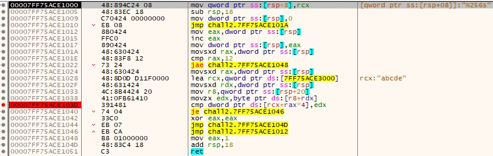

# rev-basic-2  
문제는 **correct를 출력하는 입력값**을 찾는 문제입니다.  
우선 프로그램을 실행했습니다.  
  
역시 아무거나 입력하니 실패했습니다.  
디버깅을 해서 방금 나온 실패구문을 검색했습니다.  
  
역시 실패구문과 성공구문을 확일할 수 있었습니다.  
그래서 성공/실패 분기점으로 들어갔습니다.  
  
**test eax, eax**가 분기점인걸 알 수 있고, 위에 있는 함수의 return 값에 따라 성공/실패가 갈릴 것으로 예상된다.  
그 함수로 들어갔다.  
   
디버깅을 하다보면, 중단점이 걸려있는 **cmp**와 바로 아래에 있는 **je** 명령어에 의해서 함수가 그냥 끝납니다.  
그래서 **cmp dword ptr ds:[rcx+rax*4], edx**에서 정답을 비교한다고 생각했습니다.  
또한 edx는 현재 입력한 문자를 하나씩 가져오기 때문에 이를 확신했습니다.  
그래서 dword ptr ds:[rcx+rax*4] 를 알아보기 위해 메모리로 이동했습니다.  
  
문자들이 떨어져 있었지만, 결국엔 **Comp4re_the_arr4y**이라는 답이 있었습니다.  
  
성공구문이 나왔습니다.  
따라서 정답은 **DH{Comp4re_the_arr4y}** 입니다.  
  
# IDA로 디컴파일한 결과  
  
7번째 줄에서 v4에 입력한 값이 들어가는 것을 알 수 있습니다.  
그리고 if문에 있는 함수의 return 값에 따라 성공인지 실패인지 결과가 달라집니다.  
  
그 함수로 들어갔는데, 다음과 같이 반복문이 있었습니다.  
aC라는 배열의 값과 입력한 값을 하나씩 비교해서 다르면 0(false)를 return 합니다.  
아무런 이상 없이 for문을 빠져나오면, 1(true)를 return 합니다.  
  
aC로 들어가면, 아까 메모리에 있던 것처럼 Comp4re_the_arr4y 가 있는 것을 알 수 있습니다.  

