# rev-basic-4  
문제는 **correct를 출력하는 입력값**을 찾는 문제입니다.  
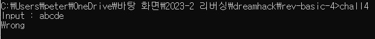  
역시 전 문제처럼 아무거나 입력하면 실패구문이 나옵니다.  
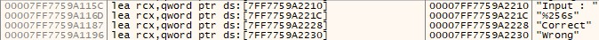 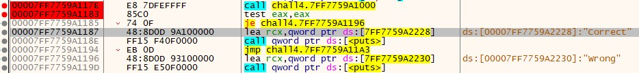  
디버깅을 하면서 실패구문을 검색하고, 분기점을 찾는 것은 동일합니다.  
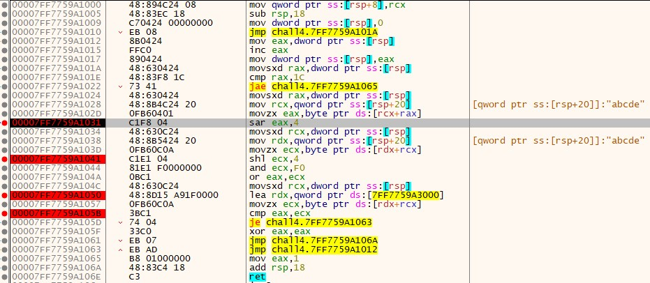  
여기서 breakpoint를 설정한 곳이 주요 연산입니다.  
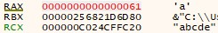 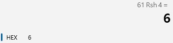 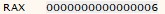  
먼저 **sar eax, 4**를 보면, 이 명령어 전까지 실행하면 eax는 다음과 같이 **입력한 문자를 하나씩 가져오는 것**을 볼 수 있습니다.  
sar eax, 4 는 **eax를 오른쪽으로 shift를 4번 한다**는 뜻입니다.  
그래서 위에 있는 것처럼 계산기로 확인한 결과와 명령어를 실행한 결과가 같습니다.  
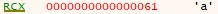 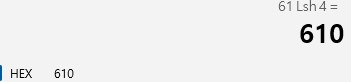 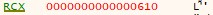  
그리고 **shl ecx, 4**를 보면, 이 명령어 전까지 실행하면 ecx에는 eax와 동일하게 **입력한 문자를 하나씩 가져오는 것**을 볼 수 있습니다.  
shl ecx, 4 는 **ecx를 왼쪽으로 shift를 4번 한다**는 뜻입니다.  
마찬가지로 위에 있는 계산기 결과와 명령어를 실행한 결과가 같습니다.  
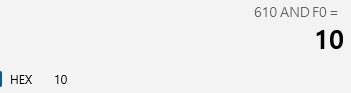 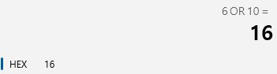 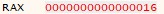  
**and ecx, F0**, **or eax, ecx**를 실행하면 다음과 같이 eax가 바뀝니다.  
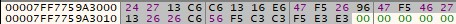 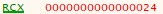  
**lea rdx, qword ptr ds:[~~]** 에서 rdx에 특정한 값을 넣고, ecx로 어떤 byte를 가져오는 것을 볼 수 있습니다.  
그래서 ecx로 값을 가져오는 메모리를 찾아봤는데, 위와 같이 알 수 없는 숫자로 채워져 있습니다.  
그런데 이 명령어 밑에 **cmp eax, ecx**에 의해 입력한 값이 같은지 다른지 비교합니다.  
따라서 위에서 **연산한 결과인 eax**와 **특정한 메모리에서 값을 가져오는 ecx**가 **같아야 한다**는 것을 알 수 있습니다.  
위의 연산을 간략하게 정리하면  
1. eax, ecx에 입력한 문자를 하나씩 가져옴  
2. eax는 right shift 4번, ecx는 left shift 4번  
3. ecx와 0xF0을 and 연산
4. eax와 ecx를 or 연산
5. 특정한 메모리에서 값을 ecx에 넣음
6. eax와 ecx를 비교함

이를 c++로 코딩하면 다음과 같습니다.  
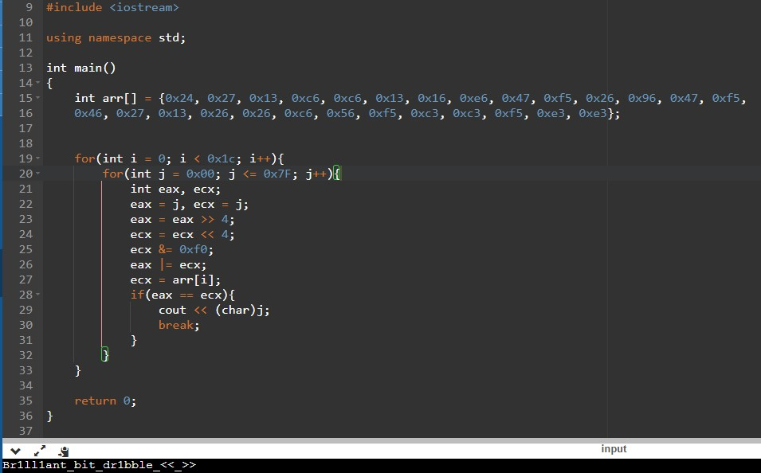 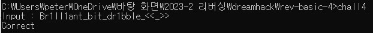  
다음과 같이 결과가 나왔고 성공구문을 볼 수 있습니다.  
따라서 정답은 **DH{Br1ll1ant_bit_dr1bble_<<_>>}**
