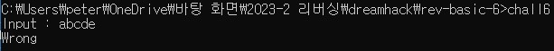
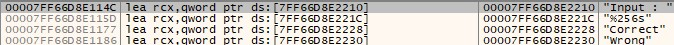
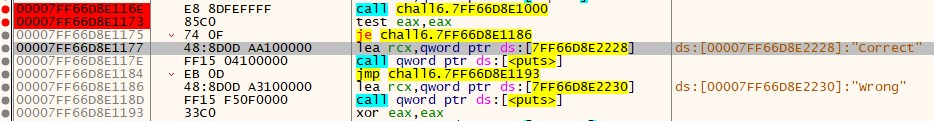
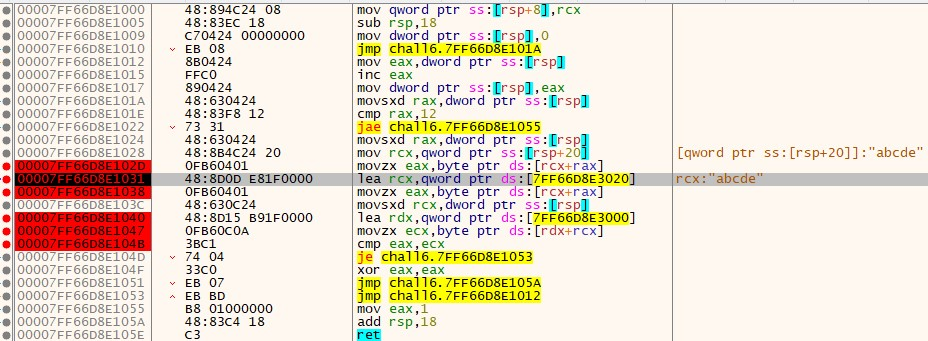
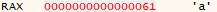
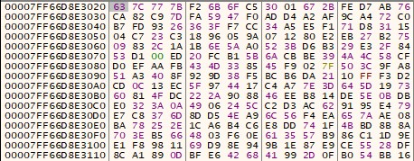
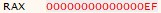
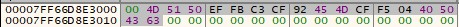
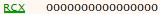
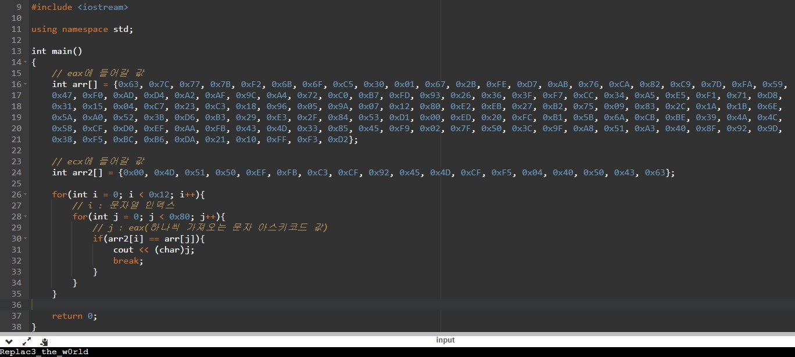

# rev-basic-6  
문제는 **correct를 출력하는 입력값** 을 찾는 문제입니다.  
    
프로그램은 다음과 같이 실패구문이 나옵니다.  
그리고 디버깅을 해서 실패구문을 찾고 이동하면, 성공/실패 분기점을 찾을 수 있습니다.  
  
그리고 함수로 들어가면 다음과 같이 구현되어있습니다.  
breakpoint를 설정한 곳을 보도록 하겠습니다.  
  
**movzx eax, byte ptr ds:[rcx+rax]** 에서 **eax에 입력한 문자를 하나씩 가져옵니다**.  
  
**lea rcx, qword ptr ds:[~~]** 에서 **~~로 되어있는 특정 주소를 rcx에 넣습니다**.  
위의 사진은 ~~ 의 메모리 값들 입니다.  
  
**movzx eax, byte ptr ds:[rcx+rax]** 에서 **rcx + rax(가져온 문자)에서 바이트만큼 eax에 넣습니다**.  
  
우선 movsxd rcx, dword ptr ss:[rsp] 에서 rcx를 문자열의 인덱스로 바꿉니다.  
그리고 **lea rdx, qword ptr ds:[~~]** 에서 **~~로 되어있는 특정 주소를 rdx에 넣습니다**.  
위의 사진은 ~~ 의 메모리 값들 입니다.  
  
**movzx ecx, byte ptr ds:[rdx+rcx]** 에서 **rdx + rcx(문자열 인덱스)에서 바이트만큼 ecx에 넣습니다**.  
그리고 **cmp eax, ecx**를 통하여 올바른지 틀렸는지 결정합니다.  
결론적으로 eax는 **입력한 문자**에 의해 영향을 받고, ecx는 **고정**되어 있습니다.  
따라서 입력한 문자를 eax가 ecx와 같은 값을 가지도록 바꿔야 합니다.  
  
다음과 같이 C++로 코딩하면 정답이 나옵니다.  
정답은 **DH{Replac3_the_w0rld}** 입니다.  
