# rev-basic-8.md  
문제는 **correct를 출력하는 입력값** 을 찾는 문제입니다.  
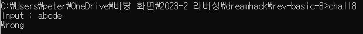 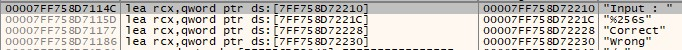 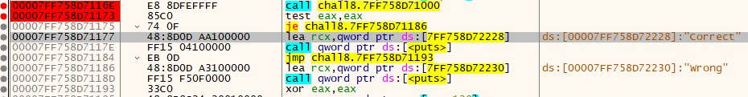  
프로그램을 실행하고, 아무거나 적으면 실패구문을 볼 수 있다.  
그리고 실패구문을 검색하고, 성공/실패 분기점으로 갈 수 있다.  
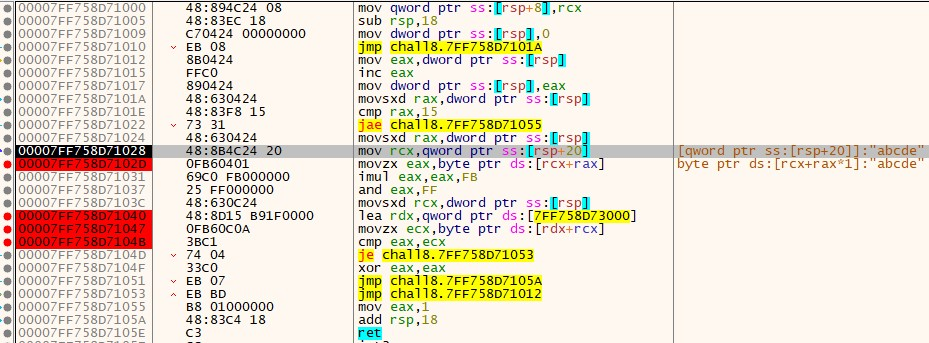  
함수에 들어가면 다음과 같이 구현되어 있다.  
이번에도 breakpoint 설정한 명령어를 볼 것이다.  
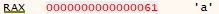  
첫번째 명령어는 **movzx eax, byte ptr ds:[rcx+rax]** 입니다.  
이 명령어에서 **eax에 입력한 문자를 하나씩 넣습니다**.  
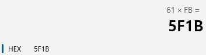 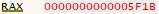  
breakpoint는 아니지만, 꼭 봐야할 명령어 2개가 있습니다.  
먼저 imul eax, eax, FB 가 있습니다.  
**eax *= 0xFB**를 연산합니다.  
계산기 결과와 명령어를 실행한 결과가 같습니다.  
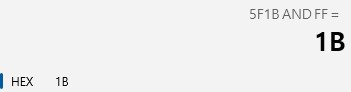 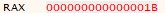  
다음으로 and eax, FF가 있습니다.  
**eax &= 0xFF**를 연산합니다.  
계산기 결과와 명령어를 실행한 결과가 같습니다.  
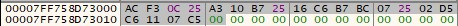
다음 명령어는 **lea rdx, qword ptr ds:[~~]** 입니다.  
**rdx에 특정한 메모리 주소를 넣습니다**.  
위의 이미지는 rdx에 넣는 메모리 주소의 메모리 값입니다.  
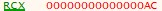  
마지막으로 **movzx ecx, byte ptr ds:[rdx+rcx]** 가 있습니다.  
**ecx에 rdx(특정한 메모리 주소) + rax(입력한 문자) 의 값을 넣습니다**.  
결론적으로, **eax는 입력한 문자의 아스키코드 값을 위의 특정한 연산을 한 결과**이다.  
**ecx는 특정한 메모리 주소에 있는 값을 문자 인덱스를 이용해 연산을 한 결과**이다.  
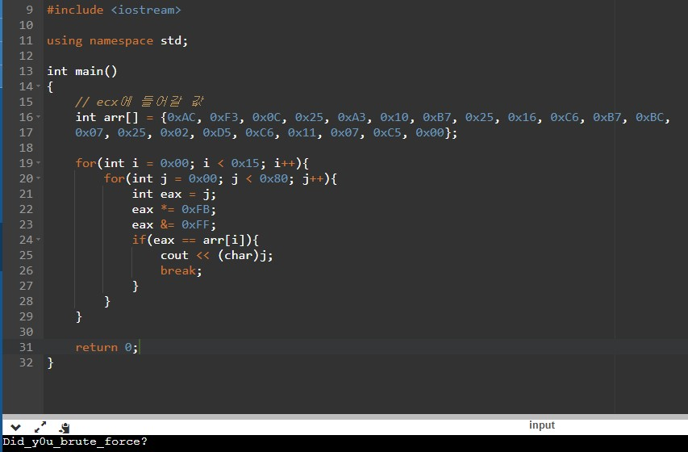  
다음과 같이 C++로 코딩할 수 있습니다.  
따라서 정답은 **DH{Did_y0u_brute_force?}** 입니다.  

