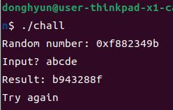
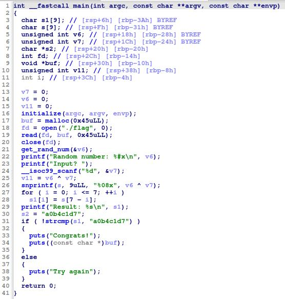
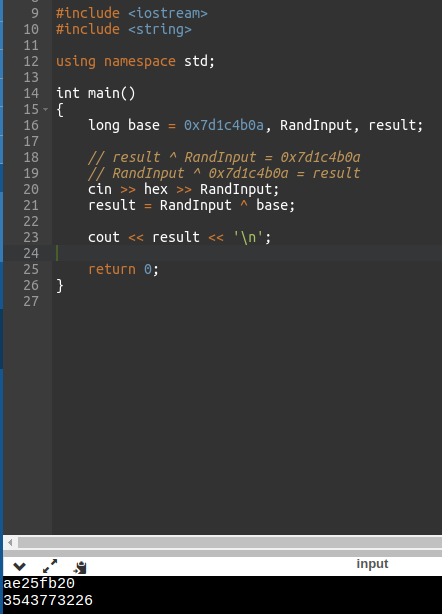
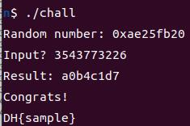
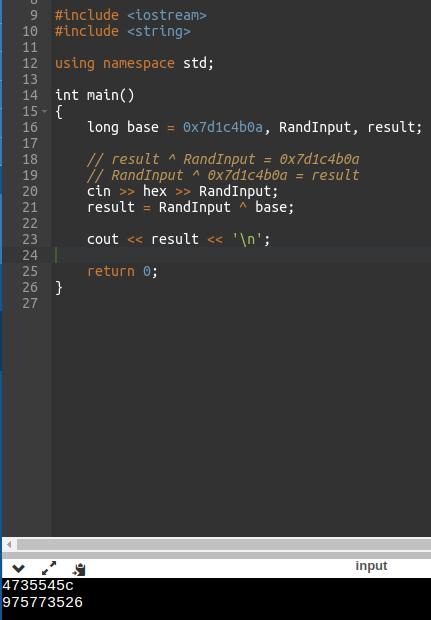
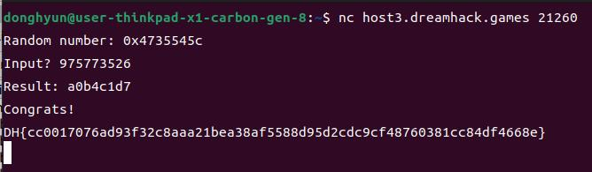

# simple-operation  
문제는 **flag가 나오는 값을 찾아서 flag를 찾는**문제입니다.  
우선 프로그램을 실행했습니다.  
  
무작위의 숫자가 나오고, 아무거나 입력을 했는데 잘못됬다는 문구가 나왔다.  
사실 처음에 디버깅으로 풀어보려고 했지만, 아직 익숙하지 않아서 IDA로 풀었다.  
  
중요한 변수는 **v6 : 무작위 숫자(16진수), v7 : 입력한 숫자(10진수), s1 : v6 ^ v7를 reverse한 결과, s2 : 고정된 특정한 문자열** 이다.  
먼저 22 ~ 23번째 줄에서 v6에 무작위의 숫자를 넣고, 출력한다.  
24번째 줄에서 v7에 숫자를 입력받는 것 같다(10진수!!)  
27 ~ 28번째 줄에서 v6 ^ v7의 결과를 반대로 바꿔서 s1에 저장한다.  
29번째 줄에서 s1을 출력한다.  
31번째 줄에서 s1과 s2(a0b4c1d7)이랑 같으면 성공, 틀리면 실패이다.  
그래서 이것도 코딩을 하려고 했다.  
그런데 v6 ^ v7의 결과를 거꾸로 하는 과정이 필요 없어보였다.  
다만, s2의 고정된 문자열을 거꾸로 해야 한다.  
즉, **reverse(v6 ^ v7) = s2**에서 **v6 ^ v7 = reverse(s2) -> 7d1c4b0a** 이면 된다고 생각했다.  
따라서 v7을 구하기 위해 xor의 성질에 의해 다음과 같이 식을 고쳤다.  
v7 ^ v6 = reverse(s2) -> **reverse(s2) ^ v6 = v7** 이다.  
   
다음과 같이 코딩을 했고, 샘플의 결과가 맞았다.  
   
따라서 정답은 **DH{cc0017076ad93f32c8aaa21bea38af5588d95d2cdc9cf48760381cc84df4668e}** 이다.  
